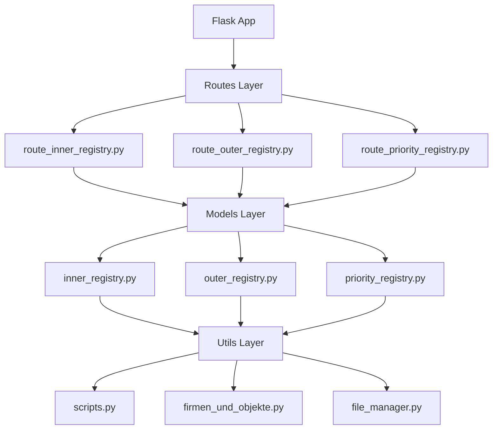

# Excelium Refactoring & Enhancement Plan

This plan outlines improvements to the excelium project code structure, focusing on:
1. Making sheets company-specific per object
2. Improving JSON parsing in `scripts.py`
3. Generalizing the codebase to produce different Excel/PDF formats

---

## Current Architecture Analysis



### Key Issues Identified

| Issue | Location | Impact |
|-------|----------|--------|
| Sheets grouped by `object_name` only | `inner_registry.py:loop_json()` | Companies mixed within same object sheet |
| Hardcoded JSON field parsing | `scripts.py:create_concatenated_info()` | Difficult to add/modify fields |
| Code duplication | All models | Similar patterns repeated across registry types |
| Tight coupling | Models ↔ Templates | Hard to add new document formats |

---

## Proposed Changes

### 1. Company*Object Sheet Grouping

#### [MODIFY] [inner_registry.py](file:///Users/akha/Programming/excelium/models/inner_registry.py)

**Current behavior**: `loop_json()` creates sheets keyed by `object_name` only
**New behavior**: Create sheets keyed by `(organization, object_name)` tuple

```diff
-for i in range(len(data)):
-    if data[i]['object_name'] not in workbook.sheetnames:
+# Pre-group data by (company, object) pairs
+from collections import defaultdict
+groups = defaultdict(list)
+for item in data:
+    key = (item['organization'], item['object_name'])
+    groups[key].append(item)
+
+for (company, object_name), entries in groups.items():
+    sheet_title = f"{company[:15]}_{object_name[:15]}"  # Excel 31-char limit
```

**Changes**:
- Group entries by `(organization, object_name)` using `defaultdict`
- Create unique sheet names that combine company and object
- Update `add_coordinators_v4()` to use the company from sheet metadata

---

### 2. Improved JSON Parsing

#### [MODIFY] [scripts.py](file:///Users/akha/Programming/excelium/utils/scripts.py)

**Problem**: `create_concatenated_info()` has repetitive code for each field

**Solution**: Data-driven field configuration

```python
# New field configuration approach
FIELD_CONFIG = [
    FieldDef(key='schet_na_oplatu', prefix='Счет на оплату №', strip_prefix='№'),
    FieldDef(key='esf', prefix='ЭСФ №', strip_prefix='№'),
    FieldDef(key='avr', prefix='Акт выполненных работ №', strip_prefix='№'),
    FieldDef(key='akt_sverki', prefix='Акт сверки ', strip_prefix='№'),
    FieldDef(key='sluzhebnaja_zapiska', prefix='Служебная записка '),
    FieldDef(key='avansovy_otchet', prefix='Авансовый отчет №', strip_prefix='№'),
    FieldDef(key='TRU'),
    FieldDef(key='letter', prefix='Письмо '),
    FieldDef(key='mediation', prefix='Медиация/Решение суда №', strip_prefix='№'),
    FieldDef(key='nakladnye', prefix='Накладные: ', pattern=r'\d+'),
    FieldDef(key='sogl_o_rastor', prefix='Согл. о расторжении №', strip_prefix='№', exclude_placeholder=True),
    FieldDef(key='prilozhenija', prefix='по приложению ', strip_prefix='Приложение '),
]
```

**Benefits**:
- Easy to add/remove/modify fields
- Centralized configuration
- Cleaner, more testable code

---

### 3. Generalized Document Generation Architecture

#### [NEW] [document_generator.py](file:///Users/akha/Programming/excelium/core/document_generator.py)

Create abstract base for document generation:

```python
from abc import ABC, abstractmethod
from typing import List, Dict, Any

class DocumentGenerator(ABC):
    """Base class for generating documents from payment data."""
    
    @abstractmethod
    def generate(self, json_data: Dict[str, Any]) -> Any:
        """Generate document from JSON data."""
        pass
    
    @abstractmethod
    def get_output_format(self) -> str:
        """Return output format: 'excel', 'pdf', etc."""
        pass
```

#### [NEW] [excel_generator.py](file:///Users/akha/Programming/excelium/core/excel_generator.py)

Base Excel generator with common functionality:

```python
class ExcelGenerator(DocumentGenerator):
    """Base class for Excel document generation."""
    
    def __init__(self, template_path: str):
        self.template_path = template_path
    
    def get_output_format(self) -> str:
        return 'excel'
    
    def group_by_company_object(self, data: List[Dict]) -> Dict[tuple, List[Dict]]:
        """Group data by (company, object) pairs."""
        groups = defaultdict(list)
        for item in data:
            key = (item.get('organization', ''), item.get('object_name', ''))
            groups[key].append(item)
        return groups
```

#### [NEW] [pdf_generator.py](file:///Users/akha/Programming/excelium/core/pdf_generator.py)

Future PDF support:

```python
class PDFGenerator(DocumentGenerator):
    """Base class for PDF document generation."""
    
    def get_output_format(self) -> str:
        return 'pdf'
```

---

### 4. Refactored Project Structure

```
excelium/
├── app.py                          # Flask app entry point
├── config.py                       # Configuration
├── core/                           # NEW: Core abstractions
│   ├── __init__.py
│   ├── document_generator.py       # Abstract base class
│   ├── excel_generator.py          # Excel base class
│   ├── pdf_generator.py            # PDF base class
│   └── field_config.py             # JSON field configurations
├── generators/                     # NEW: Concrete implementations
│   ├── __init__.py
│   ├── inner_registry_generator.py
│   ├── outer_registry_generator.py
│   └── priority_registry_generator.py
├── models/                         # Keep for backward compatibility
│   ├── inner_registry.py           # Delegates to generators
│   ├── outer_registry.py
│   └── priority_registry.py
├── routes/                         # Unchanged
├── utils/
│   ├── scripts.py                  # Simplified, uses field_config
│   ├── firmen_und_objekte.py       # Company/object mappings
│   └── file_manager.py             # File operations
└── excel_templates/                # Templates
```

---

## User Review Required

> [!IMPORTANT]
> **Sheet Naming Strategy**: With company*object grouping, sheet names will be longer. Excel has a 31-character limit. Current proposal: `{company[:15]}_{object[:15]}`. Do you have a preferred naming convention?

> [!WARNING]  
> **Breaking Change**: The new sheet structure means existing workflows that expect sheets named by object-only will need updates. Is this acceptable?

> [!CAUTION]
> **PDF Generation**: Adding PDF support requires additional dependencies (e.g., `reportlab`, `weasyprint`). Should we include this in the initial refactor or defer?

---

## Verification Plan

### Automated Tests

The existing test file at [test_app.py](file:///Users/akha/Programming/excelium/tests/test_app.py) has incomplete assertions. We will:

1. **Run existing tests** (though they are incomplete):
   ```bash
   cd /Users/akha/Programming/excelium && python -m pytest tests/test_app.py -v
   ```

2. **Add new unit tests** for:
   - `create_concatenated_info()` with various field combinations
   - `group_by_company_object()` function
   - Sheet name generation with long company/object names

3. **Integration test** with sample JSON:
   ```bash
   cd /Users/akha/Programming/excelium && python -c "
   from models.inner_registry import format_excel_inner
   import json
   with open('tests/model.json') as f:
       data = json.load(f)
   wb = format_excel_inner(data)
   print('Sheet names:', wb.sheetnames)
   # Verify sheets are grouped by company*object
   "
   ```

### Manual Verification

After implementation:
1. Run the Flask app locally: `python app.py`
2. Send a POST request with the test JSON to `/form_inner_registry`
3. Download the generated Excel file
4. Verify:
   - Sheets are separated by company AND object (not mixed)
   - All data is correctly populated
   - Coordinators are properly assigned

---

## Implementation Order

1. **Phase 1**: Fix company*object grouping in `inner_registry.py`
2. **Phase 2**: Refactor `scripts.py` JSON parsing
3. **Phase 3**: Create core abstractions (optional, if user approves larger refactor)
4. **Phase 4**: Add PDF support (if requested)
